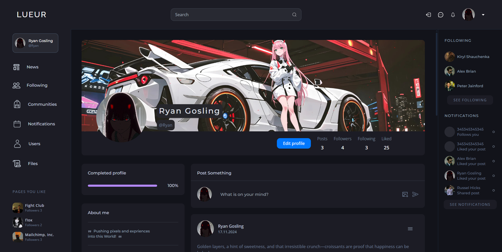
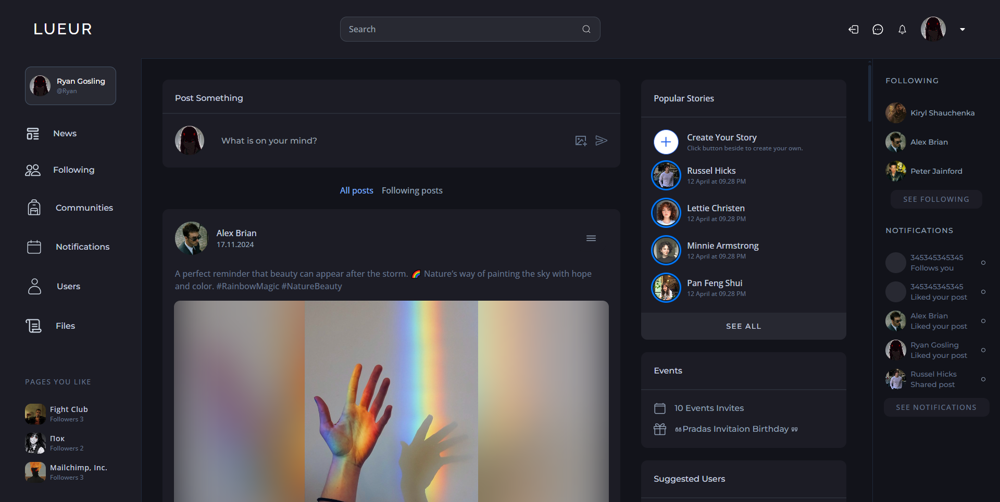
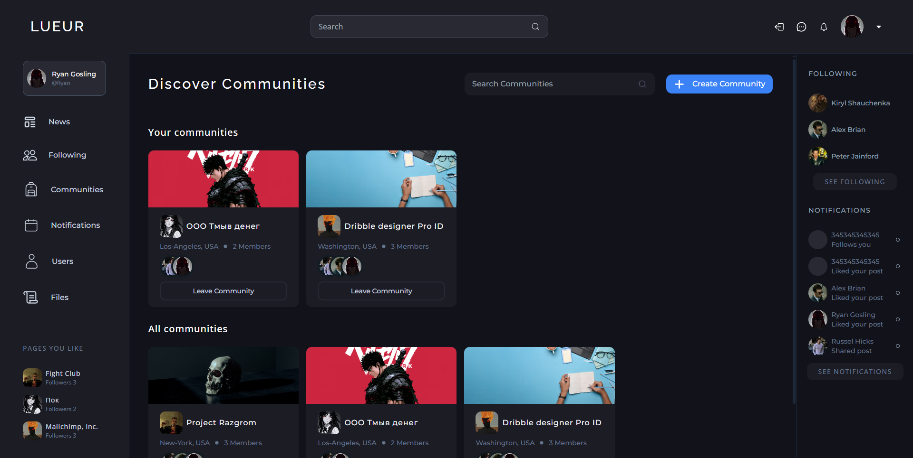
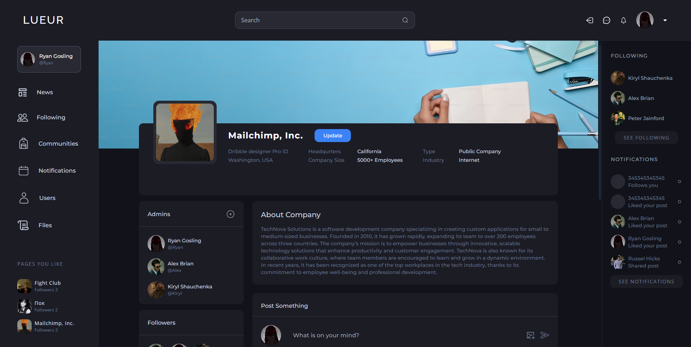
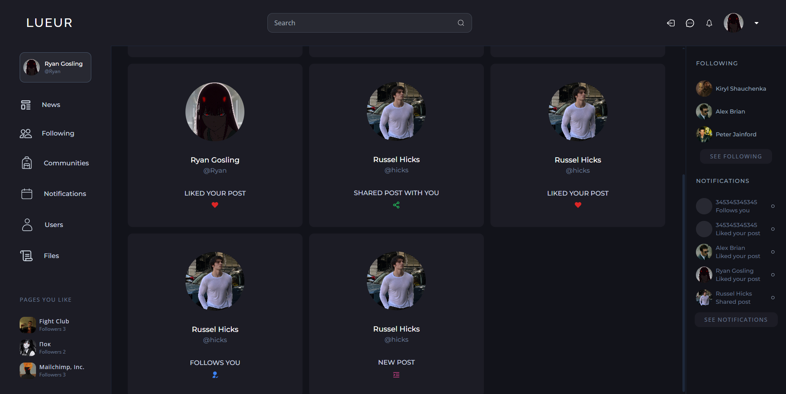

# 🌐 **Community Platform**.

> Comprehensive social platform based on Express.js and React. Supports advanced user, group, post and notification features.

---

## 📦 **Project features**.

## 🔒 **Backend**:
- **Sessions and authentication**: JWT and cookie-parser support.
- **Database**: MongoDB with Mongoose.
- **REST API**: Over 27 routes with **POST**, **GET**, **DELETE** methods and more.
- **Security**: Middleware to prevent unauthorised access.
- **Passwords**: Stored in encrypted form for greater security.

### 🎨 **Frontend**:
- **Routing and navigation**: Dynamic redirection and access protection.
- **React-Query**: Efficient application state management and data caching.
- **User interface**: Convenient user experience, responsiveness and loading system.

---

## ⚙️ **Installation**.

To start using the project, follow these steps:

1. **Install backend dependencies**.  
   ```bash
   npm and
   ```
2. **Install frontend dependencies**.
   ```bash
   cd frontend
   npm i
   ```
3. build the whole project
  ```bash
   npm run build
   ```

### 🚀 **Starting the project**:

1. **Starting the backend**.
```bash
   npm run dev
```
2. **Starting the frontend**.
```bash
   cd frontend
   npm run dev
```

### 🛠️ **User features**:
🧑‍💻 **User Profile:**.
- Display profile picture, background, bio, links and other information.
- Editing user data, including changing profile pictures.
- Information on number of posts, subscriptions and likes.
  
📝 ** Posts:**.
- Creation: Posts can contain text, images or both.
- Interactions: Ability to like, comment and share.
- Management: Deletion of posts by authors.

🏘️ **Groups (Communities):**.
- Overview: View available groups and their administrators.
- Creation: Ability to create and manage your own group.
- Administrators: Add and delete group administrators.
  
🔔 **Notifications:**.
1) Types of notifications:
- Likes of posts.
- New subscribers.
- Shares of posts.
- New posts by a user.

2) Markings: Notifications as ‘unread’ or ‘read’.

---

## 💻 **Technologies used in the project**.

## 🌐 **Backend**.
- **Express.js**.  
  Node.js framework for fast and flexible web application development. Used in the project for routing, middleware and building a RESTful API.  

- **Routing**.  
  Routing was implemented using the built-in Express.js router. With **middleware** it is possible to effectively manage routes and secure endpoints from unauthorised access.

- **Cookie-parser**.  
  Used to handle cookies to store user session data.  

- **JWT Tokens (JSON Web Tokens)**.  
  Used for secure user authentication. Tokens are stored in cookies and allow the session to remain active for a specified period of time.

- **bcrypt**.  
  Used to encrypt user passwords before storing them in the database. Provides an additional layer of security by implementing password hashing functionality.  

---

### 🎨 **Frontend**.
- **React**  
  Framework for building a user interface. Applied in the project with the **Vite** tool, enabling faster and more efficient project management.

- **TanStack React Query**.  
  Used to manage data coming from the API. With React Query, data is cached and refreshed in real-time, improving application performance and user experience.  

- **Tailwind CSS**.  
  Utility-first CSS framework used for frontend application styling. Allows you to quickly create responsive and modern user interfaces with ready-made classes.

---

## ⚙️ **API architecture**.
The project uses a RESTful API architecture with the following assumptions:
- Each endpoint is well documented and has a clearly defined function.
- Supported methods:
  - **GET**: Retrieving data from the database.
  - **POST**: Creating new resources (e.g. users, posts).
  - **DELETE**: Deleting resources (e.g. posts, groups).
  - **PATCH/PUT**: Update existing data.
- Middleware ensures that only logged-in users can use endpoints requiring authorisation.

---

## 🔒 **Security**.
- **JWT and cookie-parser** are used in combination to ensure secure session management.
- Passwords are encrypted using **bcrypt**, preventing them from being read in the event of a data leak.
- Middleware protects sensitive data by restricting access to users with appropriate permissions.

---


### 🗂️ **Database structure**.
1) **Users**
 - _id (primary key)
 - username
 - fullname
 - password
 - email
 - followers (foreign key)
 - following (foreign key)
 - profileImg
 - coverImg
 - bio
 - link
 - likedPosts(foreign key)
2) **Posts**
 - _id (primary key)
 - likes (foreign key)
 - comments (foreign ket)
 - text
 - user (foreign key)
 - img

3) **Notifications**.
 - _id (primary key)
 - read 
 - from (foreign key)
 - to (foreign key)
 - type
 - target (foreign key)

4) **Communities**
 - _id (primary key)
 - location
 - headqurters
 - companySize
 - type
 - industry
 - followers (foreign key)
 - admins (foreign key)
 - coverImg
 - profileImg

### ❗ **Error handling**.
- All errors are handled on both the frontend and backend side.
- A button locking mechanism prevents multiple requests.

  
  
  
  
  
